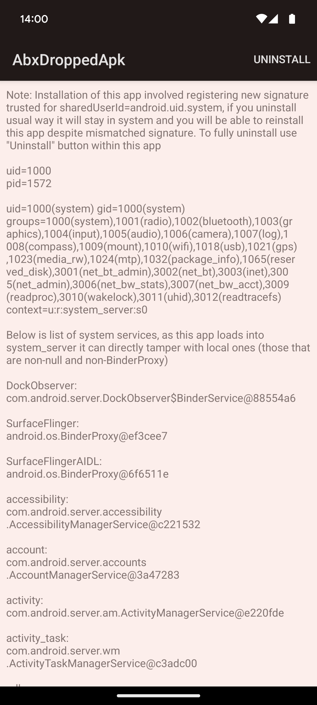

Fixes for issue described here appeared under CVE-2024-34740 / A-307288067:

* [Bulletin](https://source.android.com/docs/security/bulletin/2024-08-01#Framework)
* [Patch linked from bulletin](https://android.googlesource.com/platform/frameworks/libs/modules-utils/+/700c28908051ceb55e1456d2d21229bc17c6895a)
* Two other patches: [1](https://android.googlesource.com/platform/frameworks/base/+/8b1e072210796e9772d3d07bdbae424b38447db6%5E!/) [2](https://android.googlesource.com/platform/frameworks/base/+/7250d76a8a2d501af62081d88545c301d43106a4%5E!/)

# Android Binary XML

Inside Android `system_server`, many services store their state across reboots in XML files

```
$ adb shell su 0 find /data/system -name '*.xml' | sort
/data/system/appops_accesses.xml
/data/system/cachequota.xml
/data/system/device_policies.xml
/data/system/device_policy_state.xml
/data/system/display-manager-state.xml
/data/system/input-manager-state.xml
/data/system/inputmethod/subtypes.xml
/data/system/install_sessions.xml
/data/system/job/jobs_1000.xml
/data/system/job/jobs_10131.xml
/data/system/log-files.xml
/data/system/netpolicy.xml
/data/system/notification_policy.xml
/data/system/overlays.xml
/data/system/packages.xml
/data/system/package-watchdog.xml
/data/system/sensor_privacy_impl.xml
/data/system/sensor_privacy.xml
/data/system/shortcut_service.xml
/data/system/users/0/app_idle_stats.xml
/data/system/users/0/appwidgets.xml
/data/system/users/0/package-restrictions.xml
/data/system/users/0/settings_global.xml
/data/system/users/0/settings_secure.xml
/data/system/users/0/settings_system.xml
/data/system/users/0/wallpaper_info.xml
/data/system/users/0.xml
/data/system/users/userlist.xml
/data/system/watchlist_settings.xml
```

Historically these have been plain text XML files with indentation, which allowed developers easy reading of them, however [in Android 12 new binary version of that format was introduced, citing 1.5% of all time spent by `system_server` being spent on these XML operations](https://android.googlesource.com/platform/frameworks/base/+/4ccea8796991d678ead4399130ec31edf63ff4fa%5E%21/)

It should be noted that this format is only used internally by system and has files with magic value `"ABX\x00"`. It is different from [format used inside APKs](https://cs.android.com/android/platform/superproject/main/+/main:frameworks/base/libs/androidfw/ResourceTypes.cpp;l=1770;drc=d4e49e63519397789d284a03aea5fafc119cb1b0) for `AndroidManifest.xml`, `res/xml/*.xml`, `res/layout/*.xml`, etc. which has no explicit "magic value", however usually starts `0300 0800` (which is [header](https://cs.android.com/android/platform/superproject/main/+/main:frameworks/base/libs/androidfw/include/androidfw/ResourceTypes.h;l=608;drc=d4e49e63519397789d284a03aea5fafc119cb1b0) with `type=RES_XML_TYPE` and `headerSize=8`)

Whenever system reads one of these internal state XML files, it [uses `"ABX\0"` magic value in file to choose either parser for Binary XML file or regular XML parser](https://cs.android.com/android/platform/superproject/main/+/main:frameworks/base/core/java/android/util/Xml.java;l=188-192;drc=97a370a95275e79c69e79d7ead11aa38934a5575). Whenever these files are saved as Binary XML is [controlled by system property](https://cs.android.com/android/platform/superproject/main/+/main:frameworks/base/core/java/android/util/Xml.java;drc=97a370a95275e79c69e79d7ead11aa38934a5575;l=74?q=Xml.java) and is enabled by default

When Binary XML files are in use, you can read their contents for example through `adb shell su 0 abx2xml /data/system/packages.xml -`

One of things this binary format does is offering typed accessors, so serializer offers `attributeInt(String namespace, String name, int value)` method, which writes value as binary integer, avoiding round-trip through String which would be new allocation and subsequent object for Garbage Collection

Another type that can be directly serialized is byte array

```java
@Override
public XmlSerializer attributeBytesBase64(String namespace, String name, byte[] value)
        throws IOException {
    if (namespace != null && !namespace.isEmpty()) throw illegalNamespace();
    mOut.writeByte(ATTRIBUTE | TYPE_BYTES_BASE64);
    mOut.writeInternedUTF(name);
    mOut.writeShort(value.length);
    mOut.write(value);
    return this;
}
```

There's also similar method `attributeBytesHex` which only differs by `TYPE_*` tag written. That tag is used by `abx2xml` tool to convert byte array to appropriate String representation

`mOut` is instance of `FastDataOutput`, which provides functions of Java's [`DataOutputStream`](https://docs.oracle.com/javase/8/docs/api/java/io/DataOutputStream.html). `writeByte`/`writeShort`/`writeInt`/`writeUTF`/`write` use same format as standard `DataOutputStream`

Similarly to [`Parcel`](https://github.com/michalbednarski/ReparcelBug2), if something mismatches during write/read subsequently read data will be taken from wrong offsets, however unlike `Parcel`, mistakes with usage of `BinaryXmlSerializer`/`BinaryXmlPullParser` don't give attacker ability to arbitrarily tamper read data (attacker cannot introduce new tag/attribute names/values in that case)

Mistakes within `BinaryXmlSerializer` class itself or in `FastDataOutput` however do

In above method if we'd try to write byte array with length 65536, we'll write length with `writeShort()`, which will effectively write 0, after which actual array contents will be written

# Choosing ABX injection target

In order to exploit that mismatch, we'll need to choose some file where we'll be able to inject arbitrary byte array to `attributeBytesBase64` or `attributeBytesHex` as well as modification of that file will be valuable for attacker

[`PackageInstaller`](https://developer.android.com/reference/android/content/pm/PackageInstaller) class offers ability to prepare package for installation. Without needing any permissions, any app can write new APK to be installed into temporary directory. Once everything necessary for installation has been written, installing app can [`commit()` `PackageInstaller.Session`](https://developer.android.com/reference/android/content/pm/PackageInstaller.Session#commit(android.content.IntentSender)), which means it won't be able to do any further changes to installation files and `Session` is ready for either user approval or actual installation

State of these operations is stored in `/data/system/install_sessions.xml`. Installer app can for example download half of large APK into temporary directory created by Package Manager Service for its `PackageInstaller.Session`, then after reboot resume download, write remaining half and commit installation

One of possibilities is writing data into `install_sessions.xml` to mark session as [staged, which means it'll be installed after next boot](https://developer.android.com/reference/android/content/pm/PackageInstaller.Session#isStaged())

Another one, presented here is changing path to temporary directory in which installation files are prepared, as [`openWrite()`](https://developer.android.com/reference/android/content/pm/PackageInstaller.Session#openWrite(java.lang.String,%20long,%20long))/[`openRead()`](https://developer.android.com/reference/android/content/pm/PackageInstaller.Session#openRead(java.lang.String)) accept [any valid filename as long as there's no path traversal](https://cs.android.com/android/platform/superproject/main/+/main:frameworks/base/core/java/android/os/FileUtils.java;l=964-994;drc=97a370a95275e79c69e79d7ead11aa38934a5575) and [place that file in directory pointed by `stageDir` field](https://cs.android.com/android/platform/superproject/main/+/main:frameworks/base/services/core/java/com/android/server/pm/PackageInstallerSession.java;l=1703;drc=97a370a95275e79c69e79d7ead11aa38934a5575), which [is read from XML](https://cs.android.com/android/platform/superproject/main/+/main:frameworks/base/services/core/java/com/android/server/pm/PackageInstallerSession.java;l=5223-5224;drc=97a370a95275e79c69e79d7ead11aa38934a5575)

# Exploiting ABX injection

Now we need to actually get our controlled byte array into `attributeBytesBase64()`

`PackageInstaller.Session` offers [`setChecksums()`](https://developer.android.com/reference/android/content/pm/PackageInstaller.Session#setChecksums(java.lang.String,%20java.util.List%3Candroid.content.pm.Checksum%3E,%20byte[])) method

On `system_server` side, provided `Checksum`-s are optionally verified against signature provided by caller and then [put in `mChecksums`](https://cs.android.com/android/platform/superproject/main/+/main:frameworks/base/services/core/java/com/android/server/pm/PackageInstallerSession.java;l=1452;drc=97a370a95275e79c69e79d7ead11aa38934a5575)

When `install_sessions.xml` is written, [`checksum.getValue()` is passed to `writeByteArrayAttribute`](https://cs.android.com/android/platform/superproject/main/+/main:frameworks/base/services/core/java/com/android/server/pm/PackageInstallerSession.java;l=5152;drc=97a370a95275e79c69e79d7ead11aa38934a5575), which in turn [passes it to `attributeBytesBase64()`](https://cs.android.com/android/platform/superproject/main/+/main:frameworks/base/core/java/com/android/internal/util/XmlUtils.java;l=1917;drc=97a370a95275e79c69e79d7ead11aa38934a5575)

There are few events which trigger write of `install_sessions.xml`, one of which is [creation of new `Session`](https://cs.android.com/android/platform/superproject/main/+/main:frameworks/base/services/core/java/com/android/server/pm/PackageInstallerService.java;l=961;drc=7d3ffbae618e9e728644a96647ed709bf39ae759), therefore this exploit after setting `Checksum` on one session creates new `Session` to ensure that first `Session` has been saved to file

Now we write byte array with length 65536, then after it is read its size is interpreted to be zero and contents of that array become raw data which `BinaryXmlPullParser` parses

There is no attribute count specified, each entry has tag byte which contains `token`. In lower nibble there's one of event types defined in [`XmlPullParser`](https://developer.android.com/reference/org/xmlpull/v1/XmlPullParser), such as `START_TAG`, `END_TAG` or `END_DOCUMENT`. In addition to these types, there's special [`ATTRIBUTE`](https://cs.android.com/android/platform/superproject/main/+/main:frameworks/libs/modules-utils/java/com/android/modules/utils/BinaryXmlSerializer.java;l=77;drc=97a370a95275e79c69e79d7ead11aa38934a5575) type, which isn't reported through `next()` but instead [after seeing `START_TAG` token, parser peeks next tokens until it sees non-`ATTRIBUTE` token](https://cs.android.com/android/platform/superproject/main/+/main:frameworks/libs/modules-utils/java/com/android/modules/utils/BinaryXmlPullParser.java;l=161-207;drc=5aacbd6c06e4496d45c9e77f4b8f6c9719dd3d4c)

Since there is no count attribute count specified, we can immediately proceed to closing current element through `END_TAG` token. Then we also close `</session>` as all interesting elements attributes are in `<session>` opening tag but we're past that point, however now we can open new `<session>` element and set them there

As noted above `FastDataInput` is compatible with Java's `DataInputStream`, except there's additional [`readInternedUTF()`](https://cs.android.com/android/platform/superproject/main/+/main:frameworks/libs/modules-utils/java/com/android/modules/utils/FastDataInput.java;l=193;drc=5aacbd6c06e4496d45c9e77f4b8f6c9719dd3d4c) method, which can refer to past Strings. As we don't know what Strings were previously interned we always specify that previously-unseen String was written. This also adds newly read strings into pool, which could cause problem with reading data written after our injection point, however as part of injection I insert all ending tags and `END_DOCUMENT` token, so after my injection nothing else will be read from that file

# Using `PackageInstaller.Session` with tampered `stageDir`

Once system reads modified `install_sessions.xml`, we get `PackageInstallerSession` object with `stageDir` set to value controlled by us

My first idea was to set `stageDir` to `/proc/self`, then read `maps` and write `mem`, however these didn't work

When I tried using [`openRead()`](https://cs.android.com/android/platform/superproject/main/+/main:frameworks/base/services/core/java/com/android/server/pm/PackageInstallerSession.java;l=1775-1804;drc=97a370a95275e79c69e79d7ead11aa38934a5575) to open `/proc/self/maps`, `system_server` successfully opened the file, however passing that file to `untrusted_app` over Binder was blocked by SELinux

Writes however are done not by passing raw file descriptor to another process, but proxied through `system_server`, as `system_server` must be able to revoke write access once session is committed. Does that mean that we could write to `/proc/self/mem`? Turns out that while `system_server` can open that file, [before writing anything it calls `Os.chmod()` on that file](https://cs.android.com/android/platform/superproject/main/+/main:frameworks/base/services/core/java/com/android/server/pm/PackageInstallerSession.java;l=1713;drc=97a370a95275e79c69e79d7ead11aa38934a5575), which it cannot do on `/proc/self/mem`. So we cannot use that for exploitation here, although other than that `system_server` is able to open that file and perform writes at offsets specified by us and that file allows overwriting code pages, which would directly give us code execution

With that not being an option, I've tried next idea, replace contents of `/data/system/packages.xml`. This is file that contains state of `PackageManagerService`, most notably what apps are installed and what uids are assigned to them

It looks like `system_server` is not allowed to directly write to that file: instead whenever system writes that file it first writes to temporary file and then [replaces `packages.xml` with that temporary file and enables protection on it](https://cs.android.com/android/platform/superproject/main/+/main:frameworks/base/services/core/java/com/android/server/pm/ResilientAtomicFile.java;l=118-154;drc=884056f84f3c05c203889206fa8c132ef83f3053)

However when reading `/data/system/packages.xml`, system will [first check if `/data/system/packages-backup.xml` file is present and if so it'll consider primary `packages.xml` to be corrupted and will read backup instead](https://cs.android.com/android/platform/superproject/main/+/main:frameworks/base/services/core/java/com/android/server/pm/ResilientAtomicFile.java;l=173-193;drc=884056f84f3c05c203889206fa8c132ef83f3053). During normal operation `/data/system/packages-backup.xml` file is not present and we can create one using crafted `PackageInstallerSession` with `stageDir` set to `/data/system`

Also `system_server` is allowed to send read-only file descriptor of `/data/system/packages.xml` when I use `openRead()`, so I can easily build patched file containing only my modifications without corrupting previous contents

# Granting `sharedUserId="android.uid.system"` access

In `packages.xml` I have definitions of installed applications registered, like:

```xml
<package name="com.android.settings" codePath="/system_ext/priv-app/Settings" ... sharedUserId="1000" ...>
  <sigs count="1" schemeVersion="3">
    <cert index="3" key="308204..." />
  </sigs>
  <proper-signing-keyset identifier="2" />
</package>
```

Could we write new APK somewhere in `/data/app` (using another `PackageInstallerSession`) and add new `<package>` element to `packages.xml` and have it installed that way?

Yes, however we must provide in `<cert>` valid signature of our newly installed APK and system will check it against APK file during boot

Could we set `userId` (instead of `sharedUserId` to indicate APK without `<manifest android:sharedUserId>` attribute in `AndroidManifest.xml`) attribute to value we want?

Yes, however we must not use value that is already used by another package or `sharedUserId`

Could we set `sharedUserId="1000"` for our app?

If we do so, during boot system will validate that setting through [`canJoinSharedUserId()`](https://cs.android.com/android/platform/superproject/main/+/main:frameworks/base/services/core/java/com/android/server/pm/PackageManagerServiceUtils.java;l=658-750;drc=7ec13b04c3bbaeac99cbbc4db9f9f80492c508fe)

In particular that method will use [`checkCapability()`](https://cs.android.com/android/platform/superproject/main/+/main:frameworks/base/core/java/android/content/pm/SigningDetails.java;l=613-637;drc=97a370a95275e79c69e79d7ead11aa38934a5575) to check if signatures either match exactly or signature on one side matches one of past signatures on the other

These "past signatures" come from `packages.xml`, in particular when we have `<sigs>` element with `<cert>`, we can add `<pastSigs>` element under `<sigs>` to add new entries to [`SigningDetails.mPastSigningCertificates`](https://cs.android.com/android/platform/superproject/main/+/main:frameworks/base/core/java/android/content/pm/SigningDetails.java;l=74-87;drc=97a370a95275e79c69e79d7ead11aa38934a5575)

In the end, our tampered `<shared-user>` element looks like this:

```xml
<shared-user name="android.uid.system" userId="1000">
  <sigs count="1" schemeVersion="3">
    <cert index="3" />
    <pastSigs count="2" schemeVersion="3">
      <cert index="19" flags="2" />
      <cert index="19" flags="2" />
    </pastSigs>
  </sigs>
</shared-user>
```

`<cert>` element under `<pastSigs>` is inserted twice because [last past signature is considered current and therefore isn't considered](https://cs.android.com/android/platform/superproject/main/+/main:frameworks/base/core/java/android/content/pm/SigningDetails.java;l=698-700;drc=97a370a95275e79c69e79d7ead11aa38934a5575)

[`flags="2"` means that certificate is allowed for `sharedUserId`](https://cs.android.com/android/platform/superproject/main/+/main:frameworks/base/core/java/android/content/pm/SigningDetails.java;l=102-103;drc=97a370a95275e79c69e79d7ead11aa38934a5575)

Also `<package sharedUserId="1000">` registration must be applied to app that declares `android:sharedUserId="android.uid.system"` in manifest, so it must be separate APK from one that performs the exploitation

# Newly installed system-uid app fails to start

While I was able register new certificate trusted for `android:sharedUserId="android.uid.system"`, normally app signed with that certificate and declaring only `sharedUserId` in manifest wouldn't be able to start. When launching it we'll see following message in `logcat`:

```
signal 6 (SIGABRT), code -1 (SI_QUEUE), fault addr --------
Abort message: 'JNI FatalError called: (com.example.abxoverflow.droppedapk) frameworks/base/core/jni/com_android_internal_os_Zygote.cpp:1976: selinux_android_setcontext(1000, 0, "default:privapp:targetSdkVersion=33:complete", "com.example.abxoverflow.droppedapk") failed'
```

This is because none of definitions in [`seapp_contexts` file](https://cs.android.com/android/platform/superproject/main/+/main:system/sepolicy/private/seapp_contexts) has matched

The `user=` rule in that file is [mapped from `uid`](https://cs.android.com/android/platform/superproject/main/+/main:external/selinux/libselinux/src/android/android_seapp.c;l=819-833;drc=530165a996d8ca5ab5959c33bc040c78951bcb59) (first argument of `selinux_android_setcontext()`), in our it'll be `user=system`, for normal apps this is `user=_app`

The other thing to match is `seinfo=` rule, which is taken from 3rd argument of `selinux_android_setcontext()` up to first colon. Originally that value comes from comparison of launched app signature against ones defined in `/system/etc/selinux/plat_mac_permissions.xml`

In the end our app tries to match `user=system seinfo=default` and there is no such rule in `seapp_contexts`

However, while process for our new `android:sharedUserId="android.uid.system"` app cannot be started, app can still be loaded into existing process if specified through [`android:process` attribute](https://developer.android.com/guide/topics/manifest/application-element#proc). In particular, apps running under `android.uid.system` can specify `android:process="system"` to be loaded into `system_server`

# Crashing the system

In general [app triggering crash of `system_server` is considered bug with Negligible Security Impact](https://bughunters.google.com/learn/invalid-reports/android-platform/5148417640366080/bugs-with-negligible-security-impact#triggering-a-local-temporary-denial-of-service) and here it is only worth noting because it is part of exploit chain that requires two `system_server` restarts

Anyway, we've got `Parcelable` chain:

* [`IAlarmManager.set()` AIDL method accepts `AlarmManager.AlarmClockInfo`](https://cs.android.com/android/platform/superproject/main/+/main:frameworks/base/apex/jobscheduler/framework/java/android/app/IAlarmManager.aidl;l=32-35;drc=ca41ed611ac9c6584c6d5c38ae8428b8e4f3b135)
* [`AlarmClockInfo` calls deprecated `readParcelable()` without type argument](https://cs.android.com/android/platform/superproject/main/+/main:frameworks/base/apex/jobscheduler/framework/java/android/app/AlarmManager.java;l=1598;drc=04bf84e220ade9d7ad8ef0b2f7e6ce6ec72841c8) (because it is in apex module and these weren't switched to new methods)
* I specify [`android.content.pm.PackageParser$Activity`](https://cs.android.com/android/platform/superproject/main/+/main:frameworks/base/core/java/android/content/pm/PackageParser.java;l=8240;drc=7d3ffbae618e9e728644a96647ed709bf39ae759) as `Parcelable` class
* Reading of that leads to [invocation of any public constructor that accepts single `Parcel` argument](https://cs.android.com/android/platform/superproject/main/+/main:frameworks/base/core/java/android/content/pm/PackageParser.java;l=7789-7795;drc=7d3ffbae618e9e728644a96647ed709bf39ae759)
* I specify [`android.os.PooledStringWriter`, which calls `writeInt(0)` on provided `Parcel`](https://cs.android.com/android/platform/superproject/main/+/main:frameworks/base/core/java/android/os/PooledStringWriter.java;l=55;drc=782d49826862cbdc9d020fc9d85f8a6f64675dcb)
* That `writeInt()` call was done on `Parcel` received as `data` argument of [`onTransact()`](https://developer.android.com/reference/android/os/Binder#onTransact(int,%20android.os.Parcel,%20android.os.Parcel,%20int)), which is backed by read-only memory `mmap`-ed from `/dev/binder`. Write to that causes `SIGSEGV`

Also of note, [I've used `PackageParser`+`PooledStringWriter` combination as part of previous reports, for example for with CVE-2023-21098](https://github.com/michalbednarski/TheLastBundleMismatch)

# The whole flow

This is what happens once you press "Do everything" button within app

1. `RebootBackgroundRunner` is started as separate process, which now will just use [`setsid()`](https://man7.org/linux/man-pages/man2/setsid.2.html) to survive userspace reboot and after that will wait in background
2. New `PackageInstaller.Session` is allocated and new `Checksum` object is added to it. That `Checksum` object contains byte array with size which will cause integer overflow during serialization and once its data are deserialized back system will see `PackageInstaller.Session`-s whose data were previously `Checksum` payload. In particular, there are two sessions injected
    * One with `sessionStageDir="/data/system"` and `prepared="true"` (meaning that stage directory is already ready and doesn't need to be created)
    * One with `sessionStageDir="/data/app/dropped_apk"` and `prepared="false"` (meaning that directory will be created upon first `Session.openWrite()`)
3. New `PackageInstaller.Session` is allocated and then immediately destroyed. This triggers system to write updated contents to `install_sessions.xml`
4. After small delay, a `system_server` crash is triggered
5. During next `system_server` start, `install_sessions.xml` file is read and now `PackageInstaller.Session`-s which we injected can be used
6. `RebootBackgroundRunner` has been waiting in background during userspace reboot and once it notices that system is back up and ready it performs next steps
7. Using one `PackageInstaller.Session`, new APK is extracted from assets and written into with `/data/app/dropped_apk/base.apk`
8. Other session is used to read `/data/system/packages.xml`, that file is patched to declare that newly dropped APK has been already installed and certificate used for it was previously used for `android:sharedUserId="android.uid.system"` and is still trusted for that purpose. Altered file is written as `/data/system/packages-backup.xml`
9. Another `system_server` crash is triggered
10. When `system_server` during startup sees `packages-backup.xml`, it considers original `packages.xml` to be corrupted and uses backup instead
11. As system has read modified `packages.xml`, just dropped app is present and launches itself from [`ACTION_BOOT_COMPLETED`](https://developer.android.com/reference/android/content/Intent#ACTION_BOOT_COMPLETED). That new app runs within `system_server` because it has `<manifest android:sharedUserId="android.uid.system">` and `<application android:process="system">` in `AndroidManifest.xml`

# Scripts in `utils/`

Along with PoC app there is `utils` directory with few scripts

* `moveapk.sh` moves compiled APK to drop into `assets` of dropper, to be run after `gradle :droppedapk:assembleRelease`
* `peeksessions.sh` allows viewing current contents of `install_sessions.xml` (requires `eng`/`userdebug` build of Android)
* `wipesessions.sh` clears any present `PackageInstaller.Session`-s and restarts system (requires `eng`/`userdebug` build of Android)

# Trivia

Not sure if this is related, but looking at history for possibly ABX-related bugs (`cd frameworks/base ; git log -S ABX`) I've found ["Stop processing on IOException" commit](https://android.googlesource.com/platform/frameworks/base/+/5112cfef2a2023a2629a426154547444593e9f9b%5E!/), which **includes addition of unit test with truncated ABX file**. That commit was follow-up to ["Ignore malformed shortcuts"](https://android.googlesource.com/platform/frameworks/base/+/d5122bfaf18f1503e73c1a3a177a56d0f604a008%5E%21/), which was [described in bulletin as DoS](https://source.android.com/docs/security/bulletin/2022-12-01#framework)
